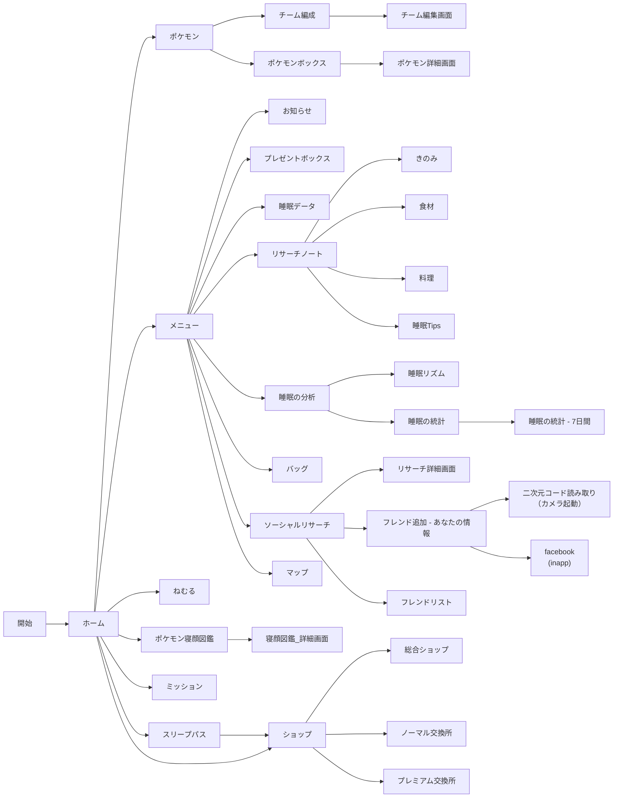

# 画面遷移図

```mermaid
flowchart LR
start[開始]

home[ホーム]
 pokemon[ポケモン]
  p_team[チーム編成]
   edit_team[チーム編集画面]
  p_box[ポケモンボックス]
   p_detail[ポケモン詳細画面]

 menu[メニュー]
  mail_box[お知らせ]
  gift_box[プレゼントボックス]
  data_sleep[睡眠データ]
  note_research[リサーチノート]
    note_berry[きのみ]
    note_food[食材]
    note_recipe[料理]
    note_tips_sleep[睡眠Tips]
  analytics_sleep[睡眠の分析]
    rythm_sleep[睡眠リズム]
    statistics_sleep[睡眠の統計]
      statistics_weekly[睡眠の統計 - 7日間]
  bag[バッグ]
  social_research[ソーシャルリサーチ]
    detail_research[リサーチ詳細画面]
    add_friend[フレンド追加 - あなたの情報]
      read_qr["二次元コード読み取り\n（カメラ起動）"]
      facebook["facebook\n(inapp)"]
    list_friend[フレンドリスト]
  maps[マップ]

  %% slp_pokedex[ポケモン寝顔図鑑]
  
 sleep[ねむる]

 slp_pokedex[ポケモン寝顔図鑑]
  detail_slp_poke[寝顔図鑑_詳細画面]
 mission[ミッション]
 sleep_pass[スリープパス]

 shop[ショップ]
  gen_shop[総合ショップ]
  exch_normal[ノーマル交換所]
  exch_premium[プレミアム交換所]


start --> home

home --> pokemon
 pokemon --> p_team
   p_team --> edit_team
 pokemon --> p_box
  p_box --> p_detail

home --> menu
 menu --> mail_box
 menu --> gift_box
 menu --> data_sleep
 menu --> note_research
  note_research --> note_berry
  note_research --> note_food
  note_research --> note_recipe
  note_research --> note_tips_sleep
 menu --> analytics_sleep
  analytics_sleep --> rythm_sleep
  analytics_sleep --> statistics_sleep
  statistics_sleep --> statistics_weekly
 menu --> bag
 menu --> social_research
  social_research --> detail_research
  social_research --> add_friend 
  social_research --> list_friend
    add_friend --> read_qr
    add_friend --> facebook
 menu --> maps

home --> sleep
home --> mission

home --> sleep_pass
 sleep_pass --> shop

home --> slp_pokedex
 slp_pokedex --> detail_slp_poke

home --> shop
 shop --> exch_normal
 shop --> exch_premium
 shop --> gen_shop
```

